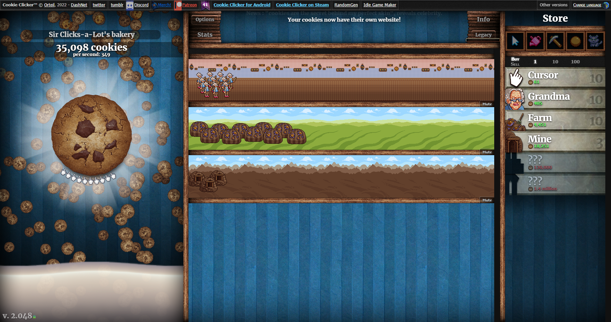
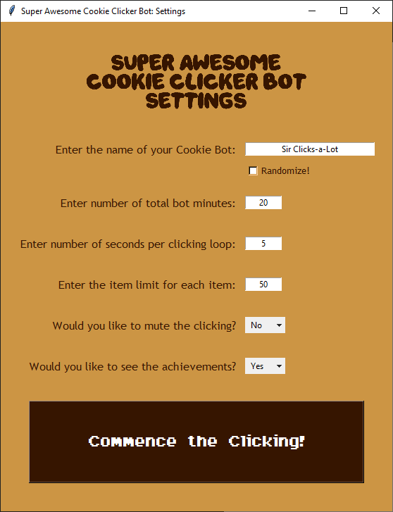

<h1>:cookie::point_up_2: Super Awesome Cookie Clicker Bot :point_up_2::cookie:</h1>

<strong>Do you enjoy playing games? Do you enjoy winning games? Do you hate getting carpal tunnel?</strong>  If any of these questions apply to you, then the <strong><em>Super Awesome Cookie Clicker Bot</em></strong> is the right bot for you!

<h2 id="table-of-contents">:book: Table of Contents</h2>

	
Table of Contents

	<ol>
		<li><a href="#game-overview"> ➤ Game Overview</a></li>
		<li><a href="#about-the-project"> ➤ About The Project</a></li>
		<li><a href="#project-files-description"> ➤ Project Files Description</a></li>
		<li><a href="#getting-started"> ➤ Getting Started</a></li>
		<li><a href="#bot-logic"> ➤ Bot Logic</a></li>
		<li><a href="#game-tips"> ➤ Game Tips</a></li>
		<li><a href="#resources"> ➤ Resources</a></li>
		<li><a href="#credits"> ➤ Credits</a></li>
	</ol>

<h2 id="game-overview">:cookie: Game Overview</h2>

Welcome to the <strong><a href="https://orteil.dashnet.org/cookieclicker">Cookie Clicking Game</a></strong>. The point of the game is to click the Big Cookie to make more cookies. These cookies can then be used as currency to buy items to help you obtain cookies automatically, or upgrades to improve the efficiency of those items.
  
There is no end (as far as I tried to get to), but the goal of this addicting game is to get your Cookies per Second (<strong>CpS</strong>) as high as possible before getting distracted and forgetting the game exists.

	

<h2 id="about-the-project">:pencil: About the Project</h2>

The purpose of the Bot is to play the <strong><a href="https://orteil.dashnet.org/cookieclicker">Cookie Clicking Game</a></strong> for you. As you can guess, this game requires a lot of clicking and waiting, which is why the Bot is so helpful. You specify certain parameters, and when you're ready, you launch the game and the Bot works its magic.

<h2 id="project-files-description"> :floppy_disk: Project Files Description</h2>
<ul>
	<li><strong>main.py</strong> - Main file that integrates the other files.</li>
	<li><strong>gamer.py</strong> - Operates the Bot and functions to interact with the browser.</li>
	<li><strong>inputter.py</strong> - Runs the GUI to allow the settings/options selected by the user prior to running the game.</li>
</ul>
<h3>Supporting Files:</h3>
<ul>
	<li><strong>fonts/</strong> - Holds the custom font files used in the settings GUI.</li>
	<li><strong>images/</strong> - Holds the pictures you're seeing on this README file.</li>
</ul>

<h2 id="getting-started">:vertical_traffic_light: Getting Started</h2>

You can begin by entering the following code into the command line while in the main working directory:

<pre><code>> python main.py</code></pre>

The Settings GUI window will then pop up. You then may specify several parameters, which are used to have the Bot play the game for you. The parameters you can specify are:

<ul>
	<li>The Bot's name</li>
	<li>The total time the Bot will play (in minutes)</li>
	<li>The amount of clicking time between checks for purchases (in seconds)</li>
	<li>The item limit for each store item</li>
	<li>Whether you would like to mute (<em>the constant clicking sound can get irritating after a while</em>)</li>
	<li>Whether you want to see the achievements on screen as they come up</li>
</ul>

	

After you click the button, sit back, relax, and let the <strong><em>Super Awesome Cookie Clicker Bot</em></strong> make it rain cookies.

<h2 id="bot-logic">:robot: Bot Logic</h2>

The Bot will keep clicking for you and occasionally check to see if it can purchase any items or upgrades. The order of operations for the Bot's clicking loop are:

<ol>
	<li><strong>Cookie Clicking</strong>
		<ol>
			<li>Checks for golden cookies (<em>bonus cookies that pop up at random times that give a temporary bonus</em>).</li>
			<li>Clicks the Big Cookie for the specified amount of time from the settings.</li>
			<li>Checks for golden cookies again.</li>
		</ol>
	</li>
	<li><strong>Upgrades</strong> - Checks if there are any available upgrades
		<ul>
			<li>Prioritizes cheapest available upgrades first.</li>
			<li>Limited to one upgrade purchase per loop.</li>
		</ul>
	</li>
	<li><strong>Store Items</strong> - Checks if there are any available store items.
		<ul>
			<li>Prioritizes most expensive available items first.</li>
			<li>Limited to one purchase per item type for each loop.</li>
			<li>Caps total purchases of each item type to specified limit amount.</li>
		</ul>
	</li>
	
</ol>

<h2 id="game-tips">:game_die: :joystick: Game Tips</h2>
<ul>
	<li>Prices increase exponentially as you purchase more of an item type, so you don't need a low item limit to be able to purchase the more expensive items. (<em>It will just take longer to get them.</em>)</li>
	<li>When the Bot completes its mission after the time limit has occurred, there will be a printout of your final <strong>CpS</strong>. Set up the Bot again with different parameters to see if you can beat your rate! Or feel free to continue playing on your own (consider the Bot a head start!).</li>
	<li>The game has ways to <em>"ascend"</em> to earn other upgrades after obtaining trillions of cookies. This resets the game and has you restart with any upgrades you got during the ascension. The Bot has not been coded to deal with this because it takes far too long to test. One day it may be added, but for now, you're on your own.</li>
</ul>

<h2 id="resources">:hammer_and_pick: Resources</h2>
<ul>
	<li><em>GUI powered by <strong>Tkinter</strong></em>
		<ul>
			<li><em>Main Font: <strong><a href="https://www.dafont.com/dragon-ball-2.font">Dragon Ball</a></strong></em></li>
			<li><em>Button Font: <strong><a href="https://www.dafont.com/arcadepix.font">Arcadepix</a></strong></em></li>
		</ul>
	</li>
	<li><em>Web Interaction powered by <strong>Selenium</strong></em></li>
	<li><em>Code powered by <strong>Me</strong></em></li>
</ul>

<h2 id="credits">:scroll: Credits</h2>

<strong>Tony Matera</strong>

<strong>Acknowledgements:</strong> Based on Day 48 of Dr. Angela Yu's Udemy Course, <em><a href="https://www.udemy.com/course/100-days-of-code/">100 Days of Code: The Complete Python Pro Bootcamp</a></em>, for the Cookie Clicking Game's <a href="http://orteil.dashnet.org/experiments/cookie/">classic version</a>.

<h3 align='center'>Happy clicking!</h3>

	

